<body>

<h2 align="center"> Ubuntu 22.04.1 LTS Install for UTM on Macbook M1/M2 (+ Configuration!) </h2>

Este é um pequeno guia sobre como instalar o Ubuntu 22.04 LTS na máquina virtual UTM (QEMU) em um Macbook com chips Apple Silicon (M1/M2). Também ensinarei passo a passo como configurar o Ubuntu para que você tenha uma boa GUI no final.

  

<h2>Tutorial</h2>

Primeiro passo: Iremos fazer o download e instalação do UTM: <a href="https://mac.getutm.app" title="UTM"> clique aqui </a>

  

Segundo passo: Iremos fazer o download da ISO 64-bit ARM (ARMv8/AArch64): <a href="https://cdimage.ubuntu.com/jammy/daily-live/20230112/" title="Linux"> clique aqui </a>

  

  

Terceiro passo: Iremos fazer a configuração do sistema operacional

Passo 1: 

  

  

Passo 2: 

  

  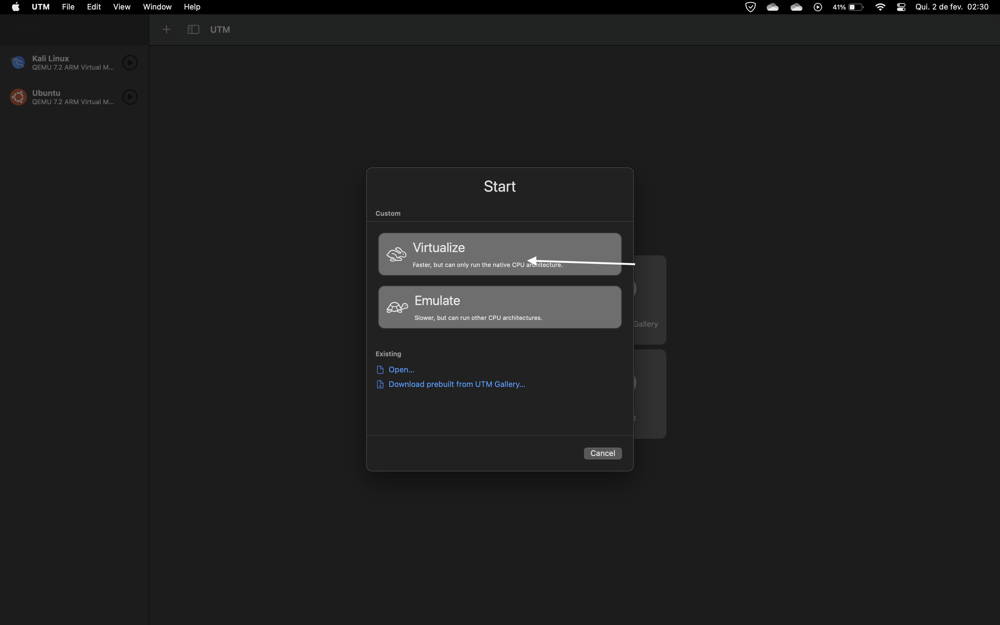

  

Passo 3: 

  

  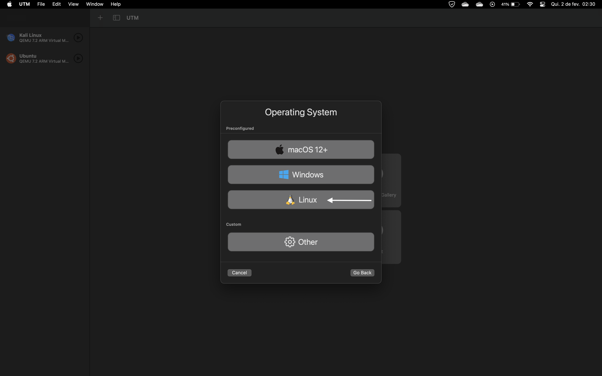

  

Passo 4: 

  

  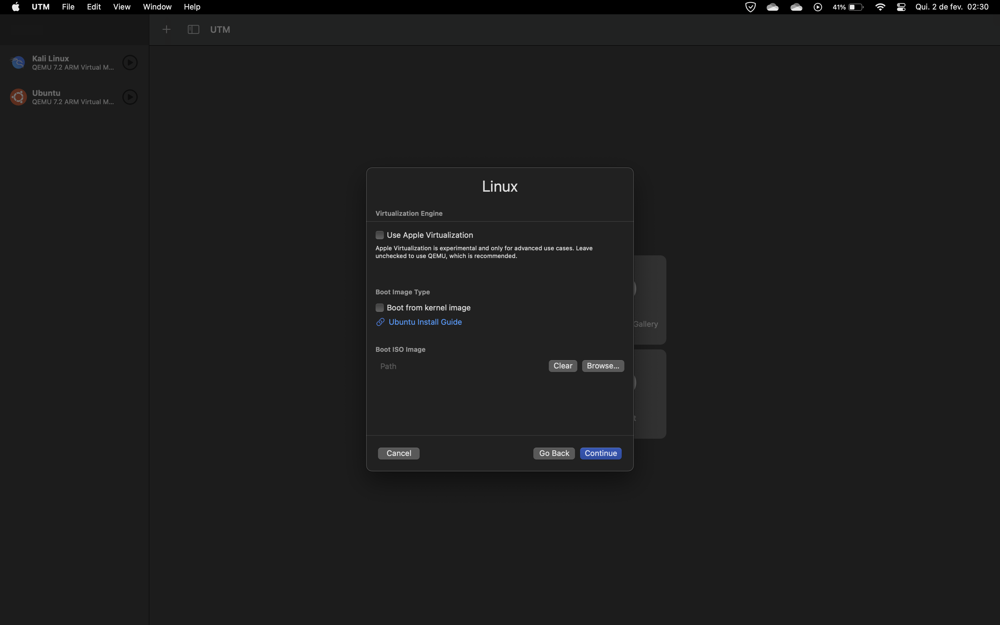

Passo 5: 

  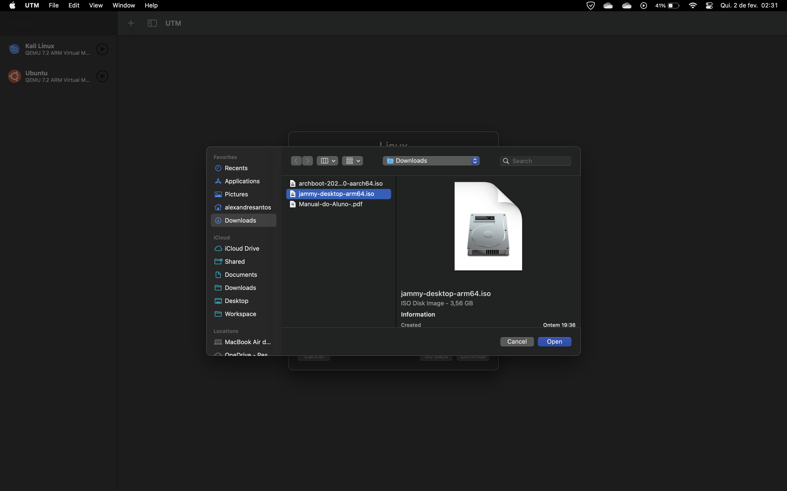

  

Passo 6: 

  

  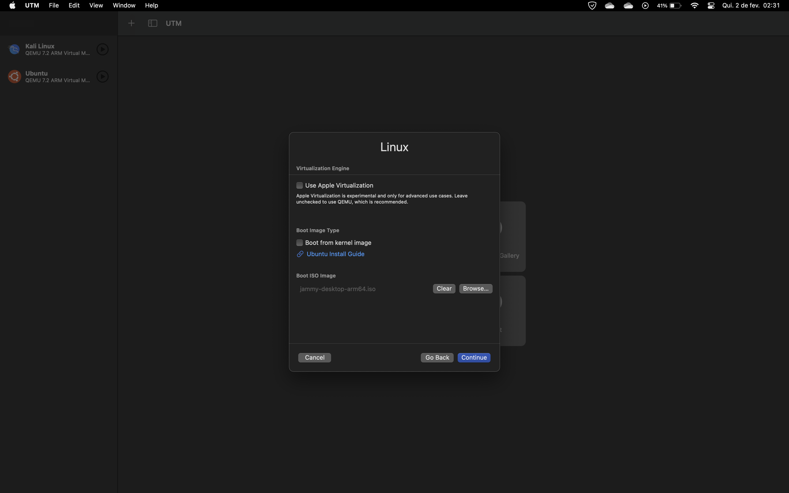

  

Passo 7: 

  

  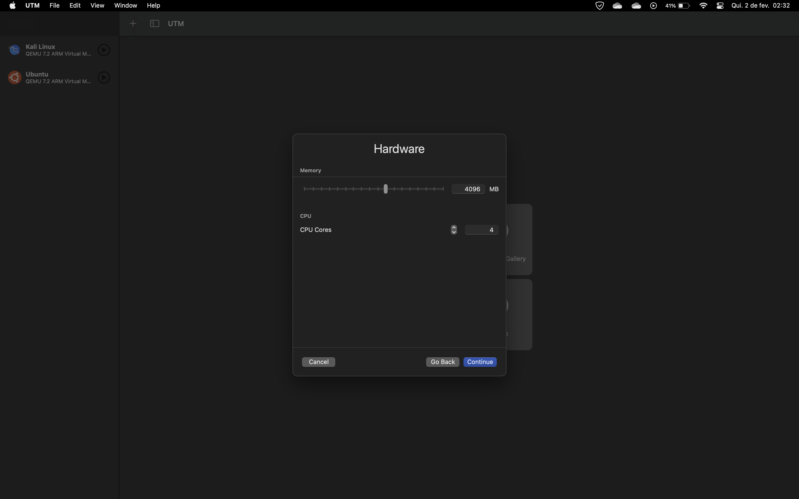

  

Passo 8: 

  

  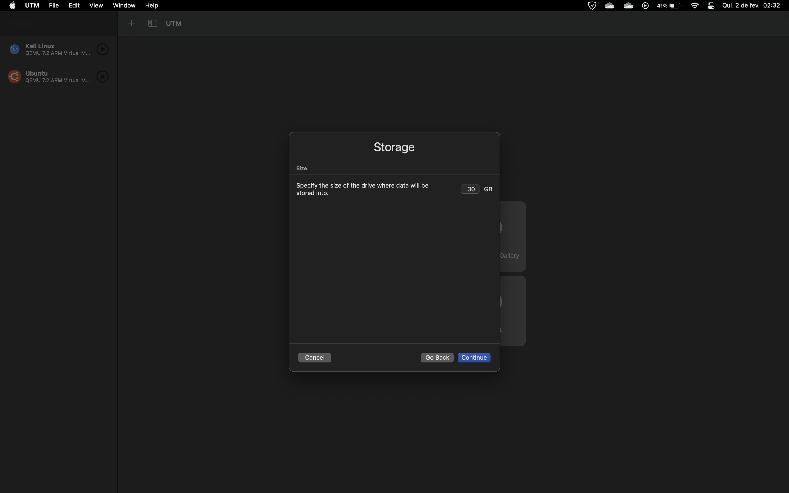

  
  

Passo 9: 

  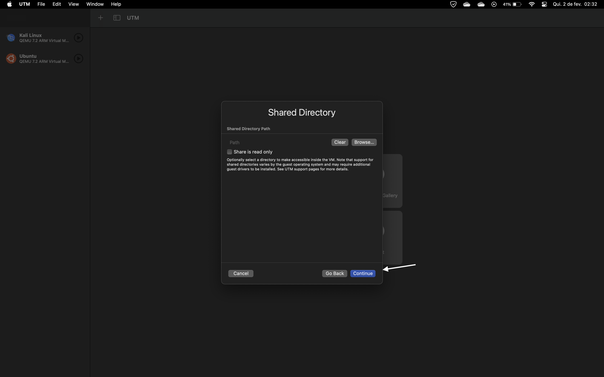

  

Passo 10: 

  

  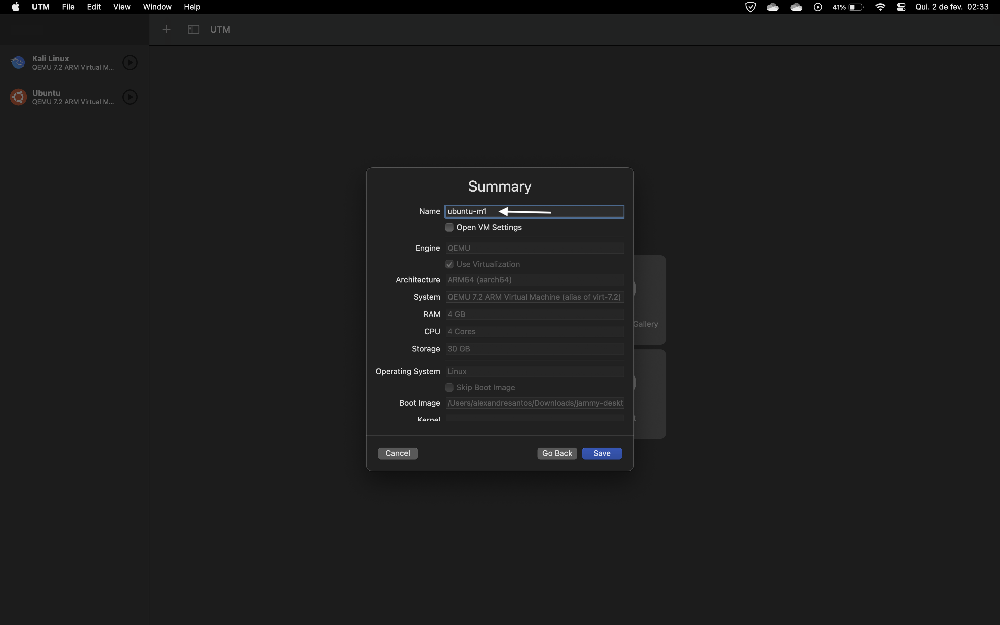

  

Passo 11: 

  

  

  

Passo 12: 

  

  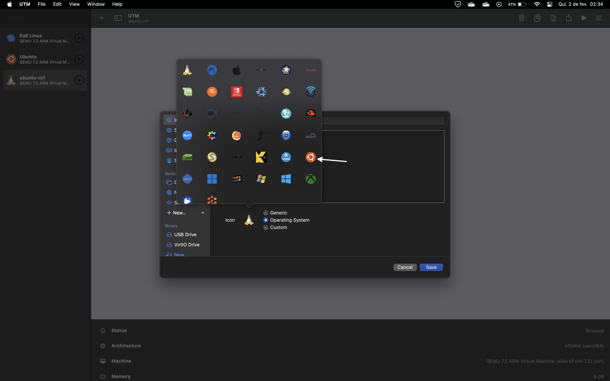

  

Passo 13: 

  

  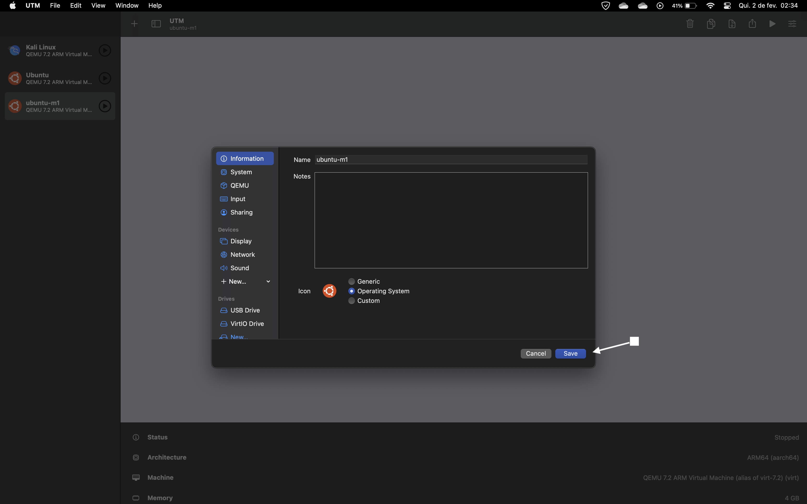

Passo 14: 

  

  

  

Passo 15: 

  

  

  

Passo 16: 

  

  

  

Passo 17: 

  

  

  

Passo 18: 

  

  

  

Passo 19: 

  

  

  

Passo 20: 

  

  

  
</body>
