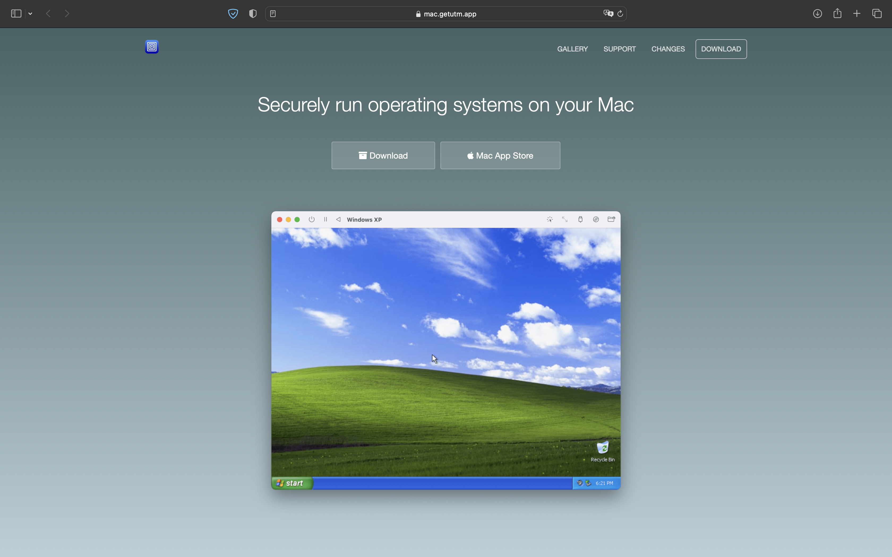
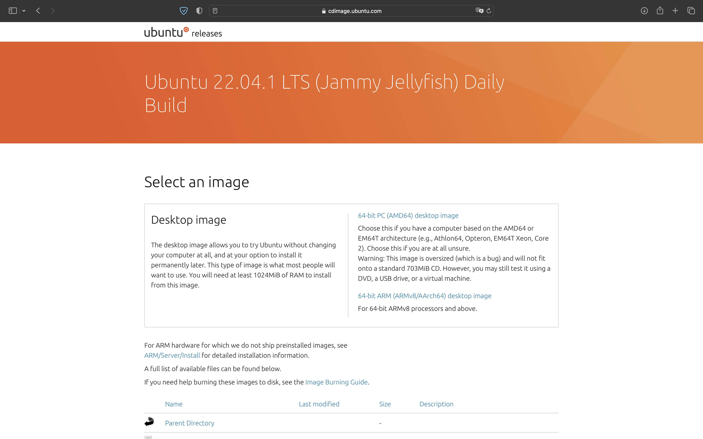
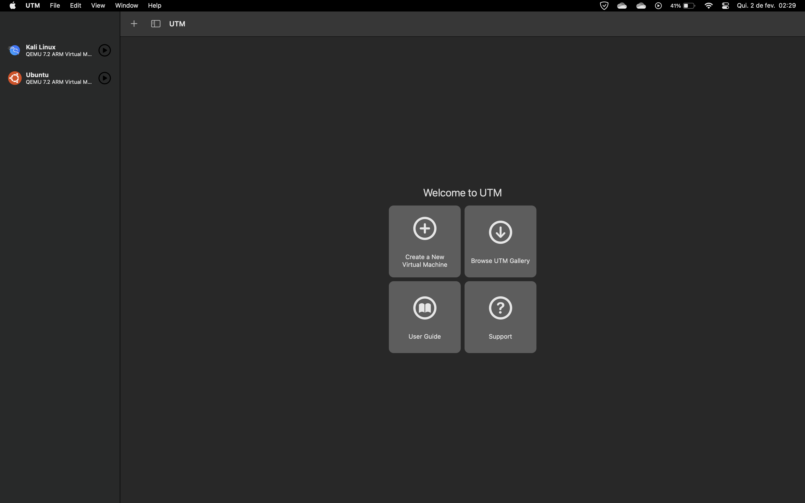

<body>

<h2 align="center">Tutorial de instalação do Ubuntu 22.04.1 LTS no Macbook M1/M2</h2>

Este é um pequeno guia sobre como instalar o Ubuntu 22.04 LTS na máquina virtual UTM (QEMU) em um Macbook com 
chips Apple Silicon (M1/M2). Também ensinarei passo a passo como configurar o Ubuntu.

  

<h2>Tutorial</h2>

Primeiro passo: Iremos fazer o download e instalação do UTM: <a href="https://mac.getutm.app" title="UTM"> clique aqui </a>

  

Segundo passo: Iremos fazer o download da ISO 64-bit ARM (ARMv8/AArch64): <a href="https://cdimage.ubuntu.com/jammy/daily-live/20230112/" title="Linux"> clique aqui </a>

  

  

Terceiro passo: Iremos fazer a configuração do sistema operacional

  

<h1> Em desenvolvimento </h1>
  
</body>
